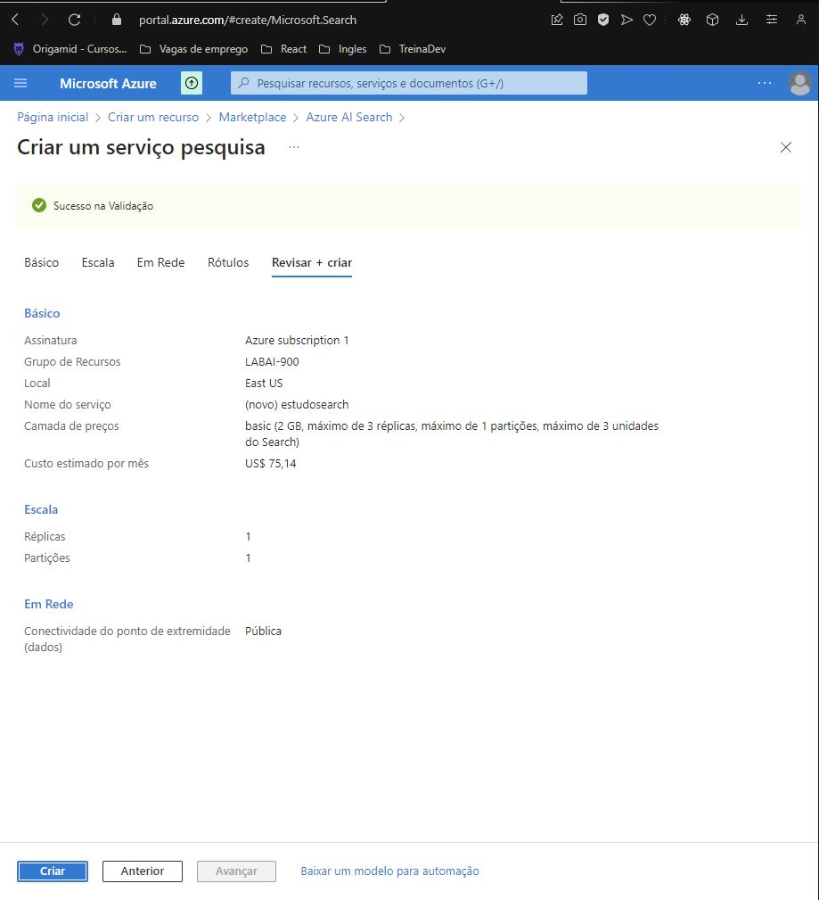
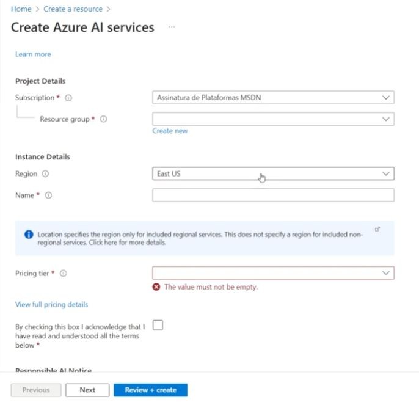
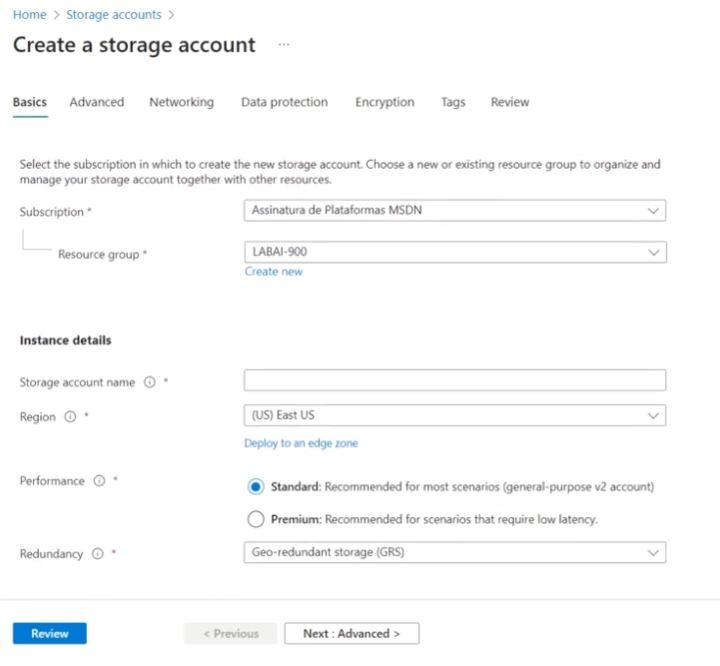
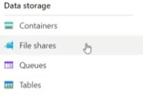
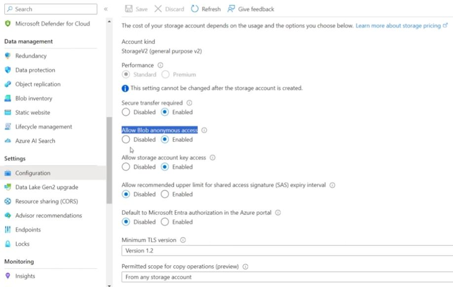
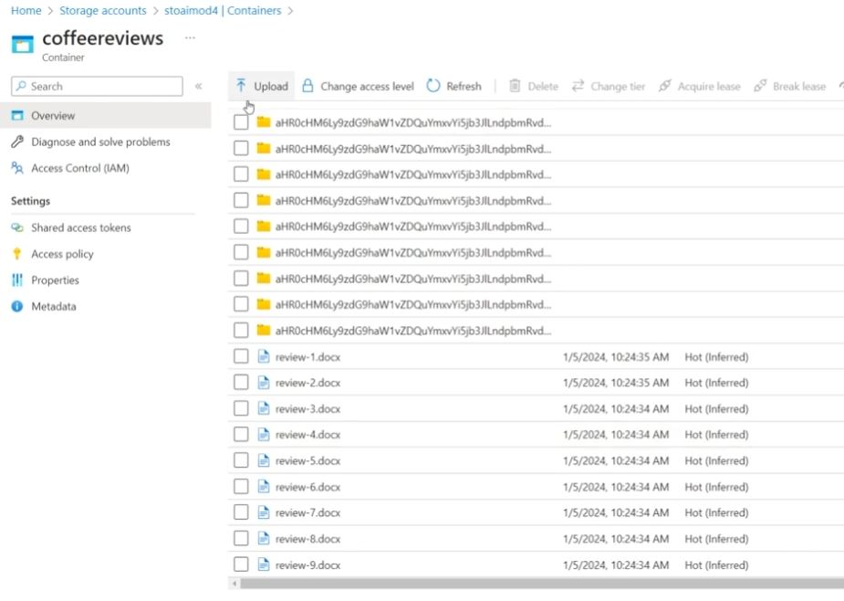

Chegou a hora de você construir um portfólio ainda mais rico e impressionar futuros recrutadores, para isso é sempre importante mostrar os resultados do seu esforço e como você os obteve deixando claro o seu racional, para isso faça da seguinte maneira:

1. Crie um novo repositório no github com um nome a sua preferência
2. Crie um um arquivo readme.md descrevendo o passo a passo para se configurar uma pesquisa, assim como seus insights, possibilidades de ferramentas que se beneficiam com esse tipo de ferramenta e aprendizados adquiridos durante o processo.
3. Compartilhe conosco o link desse repositório através do botão 'entregar projeto'
4. documentação https://microsoftlearning.github.io/mslearn-ai-fundamentals/Instructions/Labs/11-ai-search.html#index-the-documents

<h2>Criando o serviço de IA search</h2>

 

<h2>Criando outro serviço IA </h2>

 

<h2>Criando o storage da conta </h2>

<h2>Aqui é onde vai fica separado os tipos de dados</h2>

 

<h2>Configuração</h2>

Precisa abilitar a opção Allow Blob anonymous access.

 

<h2>Dados utilizados</h2>

Esses dados são fictícios oferecido pela documentação da azure. 

 

<h2>Resultado</h2>

Na imagem mostra como funciona a pesquisa, no exemplo e usado a cidade como filtro. 

