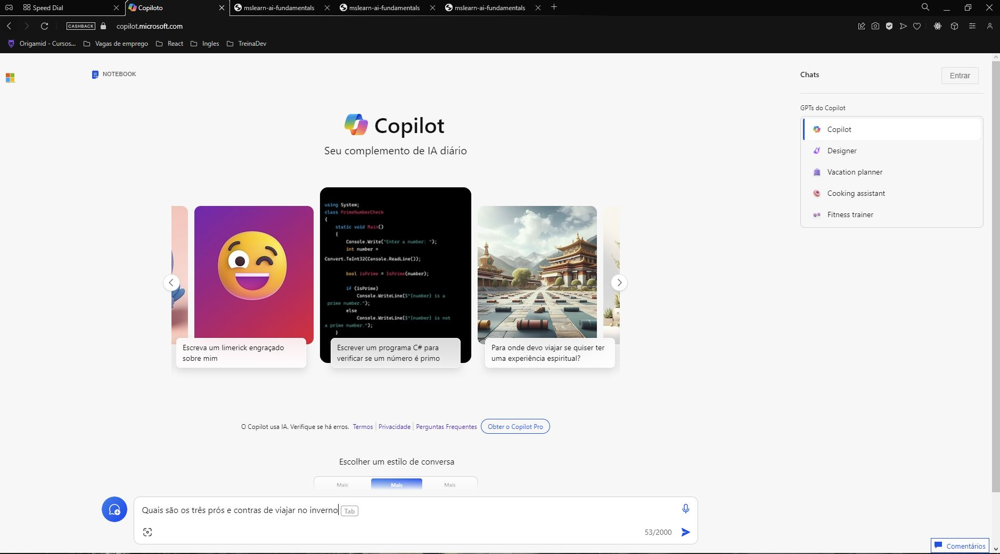
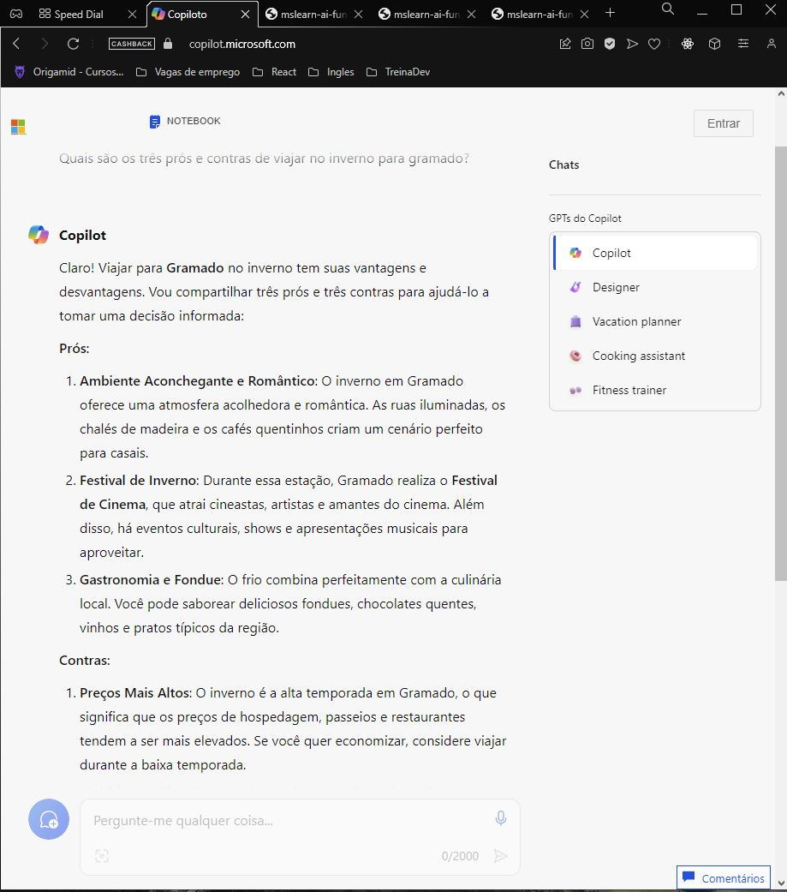
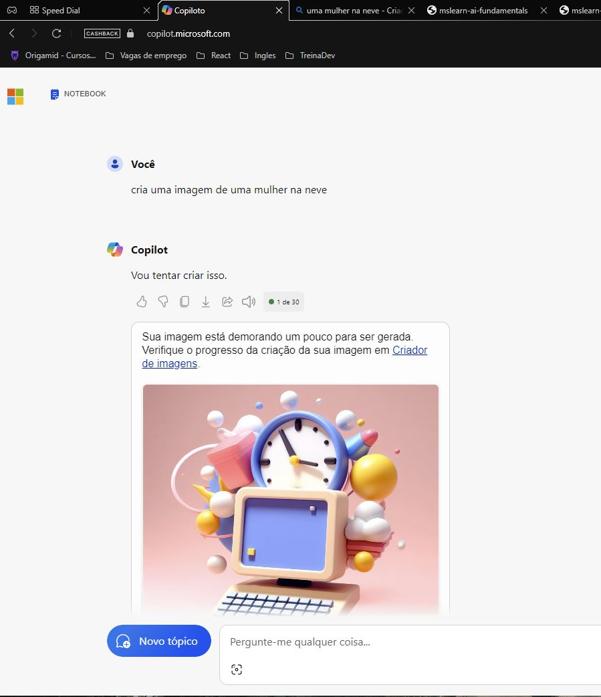

<h1>Prática 01</h1>

link | https://copilot.microsoft.com/?azure-portal=true

Documentação | https://microsoftlearning.github.io/mslearn-ai-fundamentals/Instructions/Labs/12-generative-ai.html

 
<h2>Utilizando geradfor de texto fazendo uma pergunta</h2>

 
<h2>Trabalhando com gerador de imgens</h2>

Abaixo esta um exemplo de como ficaria, processo pelo visto é bem lento entao deixei so como exemplo a telinha aonde ficaria a imagem gerada

