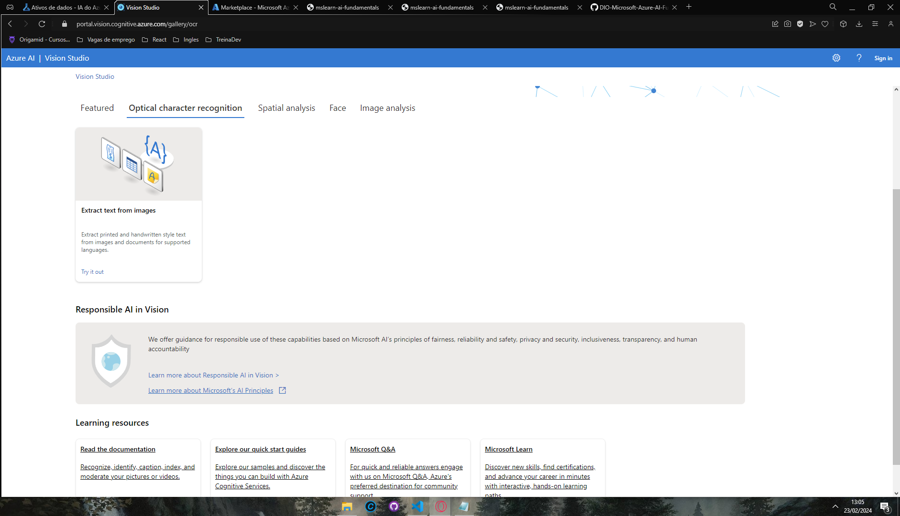
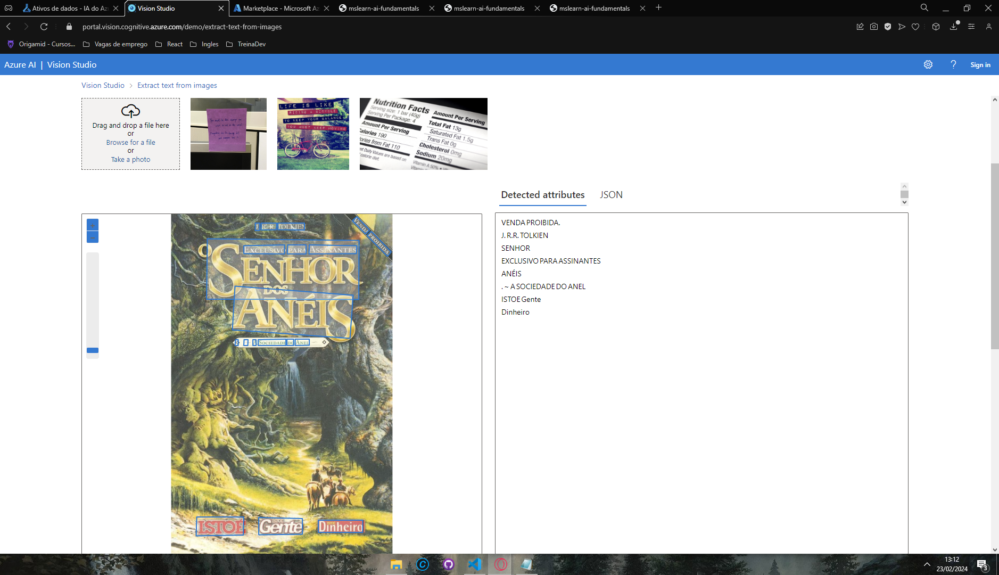
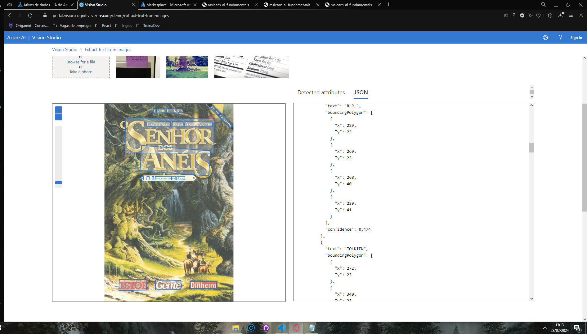
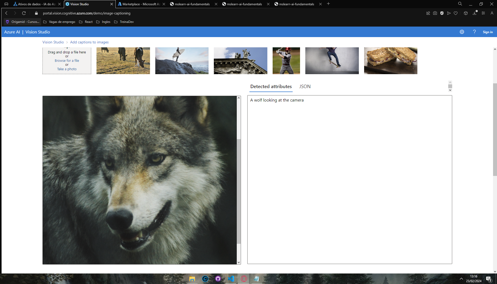
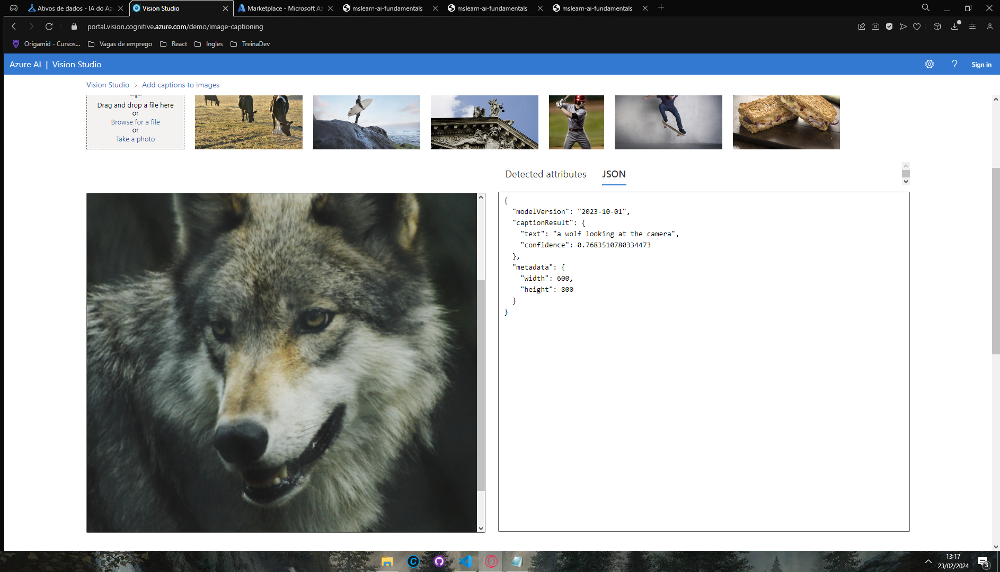
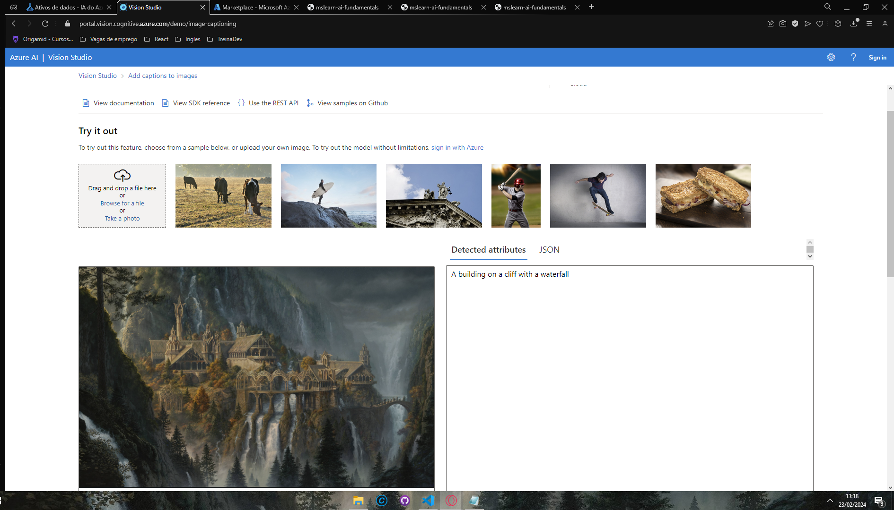

Como Entregar esse projeto?

Chegou a hora de você construir um portfólio ainda mais rico e impressionar futuros recrutadores, para isso é sempre importante mostrar os resultados do seu esforço e como você os obteve deixando claro o seu racional, para isso faça da seguinte maneira:

1. Crie um novo repositório no github com um nome a sua preferência
2. Crie uma pasta chamada 'inputs' e salve as imagens que você utilizou
3. Crie uma pasta chamado 'output' e salve os resultados de reconhecimento de texto nessas imagens
4. Crie um arquivo chamado readme.md , deixe alguns prints descreva o processo, alguns insights e possibilidades que você aprendeu durante o conteúdo.
5. Compartilhe conosco o link desse repositório através do botão 'entregar projeto'
    
   
    

<h2>-Extraindo texto de imagem.</h2>
 

Imagem usada para teste.

 

<h2>Resultado:</h2>

<h2>-Extraindo a ação da imagem para descreve-la.</h2>

Imagens usada para teste.

<h2>Resultado:</h2>

