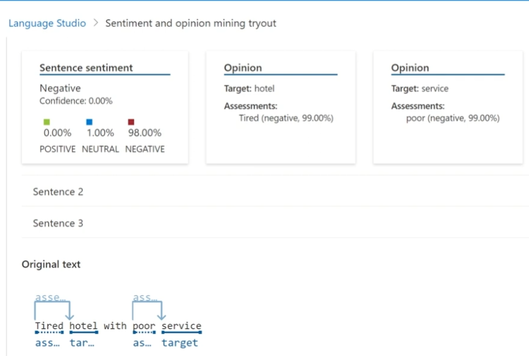

Chegou a hora de você construir um portfólio ainda mais rico e impressionar futuros recrutadores, para isso é sempre importante mostrar os resultados do seu esforço e como você os obteve deixando claro o seu racional, para isso faça da seguinte maneira:

1. Crie um novo repositório no github com um nome a sua preferência
2. Crie uma pasta chamada 'inputs' e crie um documento de texto com algumas sentenças
3. Crie um arquivo chamado readme.md , deixe alguns prints descreva o processo, alguns insights e possibilidades que você aprendeu durante o conteúdo após a IA analisar suas sentenças
4. Compartilhe conosco o link desse repositório através do botão 'entregar projeto'
    
   
    

<h2>Criando Recurso.</h2>

 
<h2>Conversação de fala em texto em tempo real.</h2>
 
   

Campo na qual pode criar um áudio ou fazer um upload dele.

 
   

Sera mostrado ate o JSON do áudio que foi utilizado.

<h2>Serviço de language</h2>

Criando serviço de linguagem.

 

 

 

Finalizando o deploy do serviço criado.

 

Serviço criado.

 

<h3>Teste com texto do documento.</h3>

 

 
