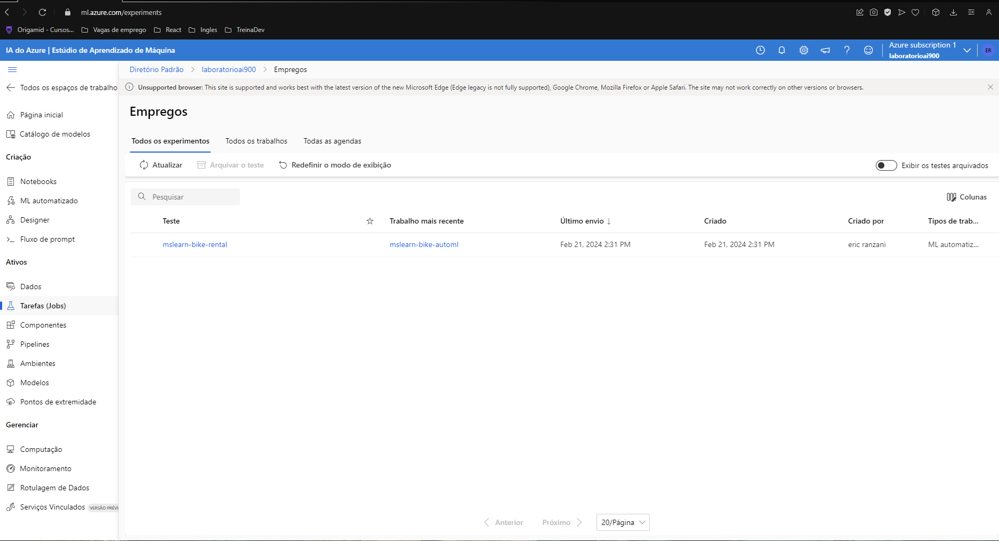
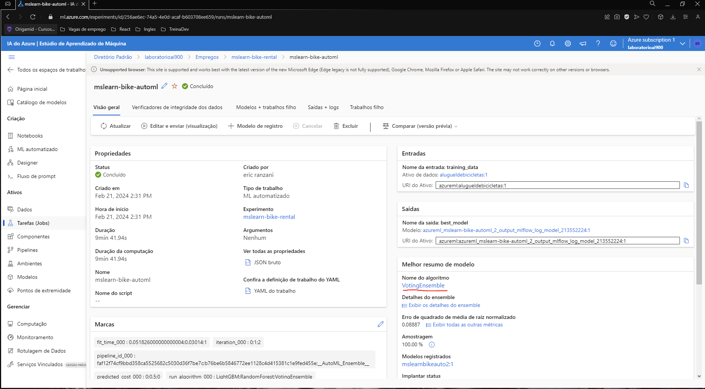
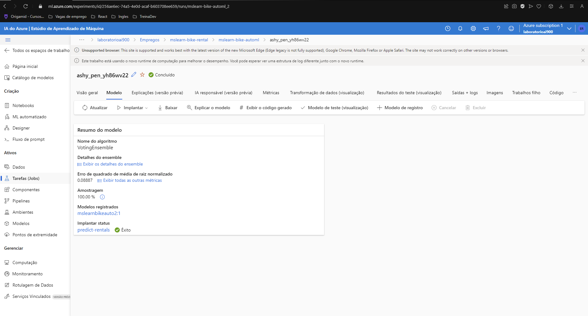
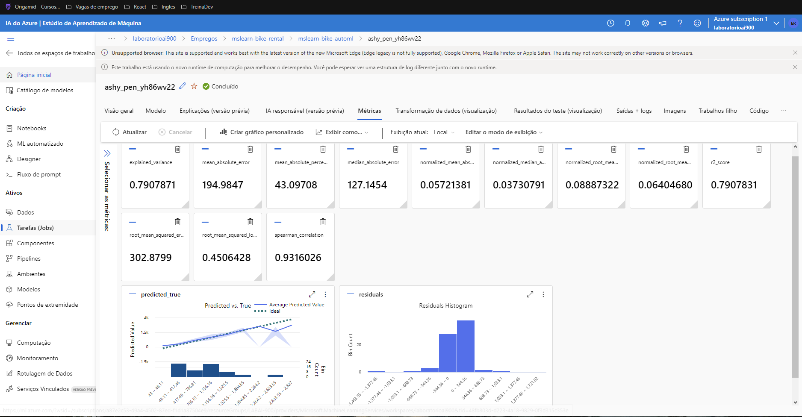
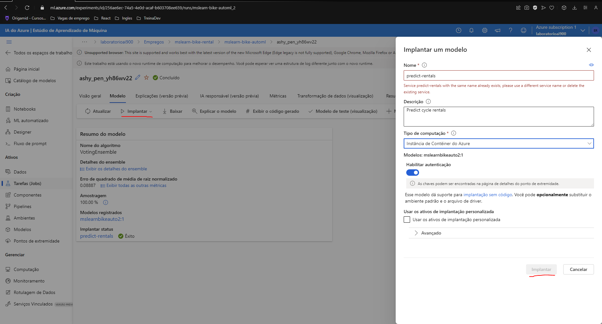
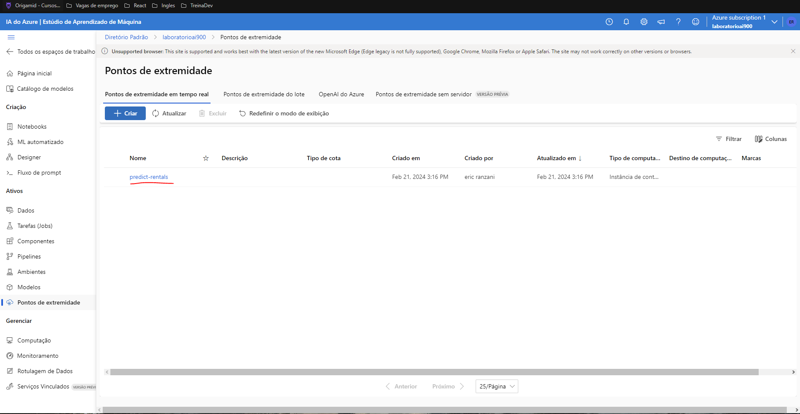
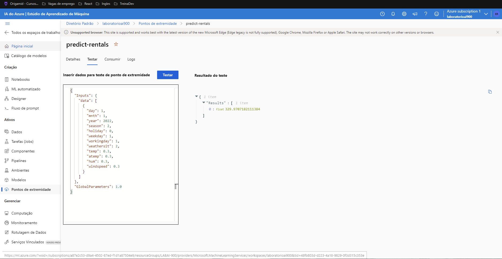

Como Entregar esse projeto?
Chegou a hora de você construir um portfólio ainda mais rico e impressionar futuros recrutadores, para isso é sempre importante mostrar os resultados do seu esforço e como você os obteve deixando claro o seu racional, para isso faça da seguinte maneira:

1. Crie um novo repositório no github com um nome a sua preferência
2. Crie um modelo de previsão com seus devidos pontos de extremidade configurados
3. Escreva o passo a passo desse processo em um readme.md de como você chegou nessa etapa
4. Salve nesse repositório o readme.md e o arquivo .json de pontos de extremidade
5. Compartilhe conosco o link desse repositório através do botão 'entregar projeto'

